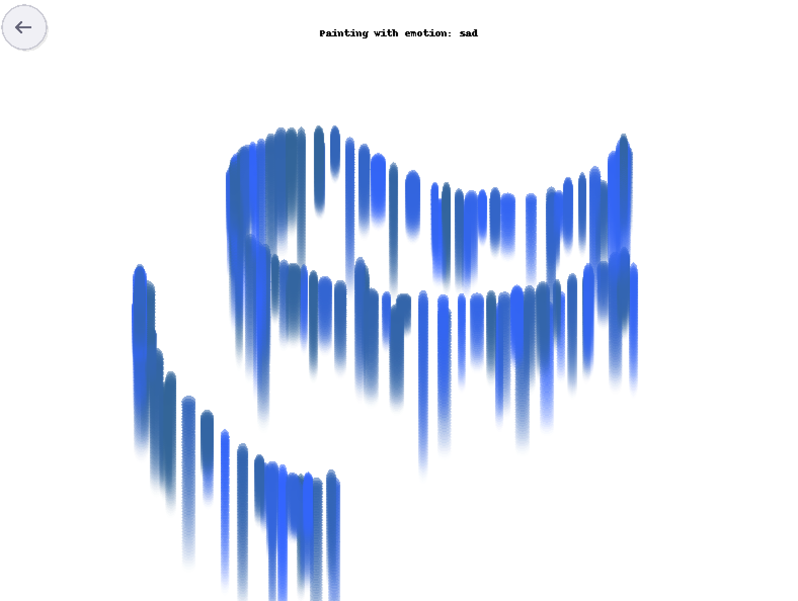

# Emotion Painting

By choosing one of four emotional images — Happy, Sad, Angry, or Calm — users can draw on the canvas, and each emotion generates a unique visual effect:

- Happy: Bright yellow bubbles float upward, full of vitality
- Sad: Blue teardrops fall slowly with gradient effects
- Angry: Fiery red sparks explode and scatter intensely
- Calm: Gentle green-blue ripples expand outward peacefully

## Interaction Design
- User Input: Mouse click and drag
- System Response: Real-time generation of emotion-based particle effects

## How to run
1. Install the p5 library
```bash
pip install p5 Pillow==9.5.0 vispy==0.10.0
```

2. Run the program
```bash
python main.py
```
3. Choose an emotion
Click one of the four emotion images.

4. Draw with your mouse
Drag your mouse to create emotion-driven visuals.

5. Return to the menu
Click the small round arrow button in the top-left corner to choose a new emotion.

## Preview
<p align="center">
  
  
  
  
</p>

## Screenshot
<p align="center">
  
</p>
